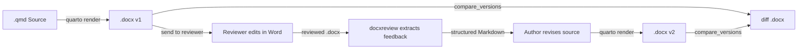

# docxreview

<!-- badges: start -->
[](https://lifecycle.r-lib.org/articles/stages.html#experimental)
<!-- badges: end -->

docxreview extracts comments and tracked changes from reviewed Word documents
(.docx) and returns them as structured data or formatted Markdown. It is
designed for workflows where documents are rendered from Quarto or R Markdown,
reviewed in Microsoft Word, and feedback needs to be processed
programmatically — for example by passing the structured output to an LLM for
automated revision.

## Installation

Install the development version from GitHub:

```r
# install.packages("remotes")
remotes::install_github("SchmidtPaul/docxreview")
```

## Quick Start

```r
library(docxreview)

# Get a formatted Markdown summary of all review feedback
extract_review("report_reviewed.docx")

# Save to file
extract_review("report_reviewed.docx", output_file = "feedback.md")

# Programmatic access as tibbles
comments <- extract_comments("report_reviewed.docx")
changes  <- extract_tracked_changes("report_reviewed.docx")
```

## Workflow

The typical use case is a Quarto/R Markdown review cycle:



1. **Render** your Quarto or R Markdown document to `.docx`.
2. **Send** the `.docx` to a reviewer who adds comments and tracked changes in
   Microsoft Word.
3. **Extract** the feedback with `extract_review()` to get a structured Markdown
   summary of all comments, insertions, and deletions — including paragraph
   context.
4. **Revise** your source document based on the extracted feedback.
5. **Compare** old and new renders with `compare_versions()` to produce a diff
   `.docx` with tracked changes — so the reviewer can see exactly what changed.

## LLM-Assisted Workflow

The structured Markdown output from `extract_review()` can be passed to any LLM
to automate source revisions. A prompt like the following works with ChatGPT,
Claude, Gemini, or any other LLM that has access to your project files:

> "Here is the review feedback extracted from the reviewed DOCX. Please revise
> `report.qmd` to address all comments and tracked changes."

### Claude Code Integration

docxreview ships with a [Claude Code](https://docs.anthropic.com/en/docs/claude-code)
skill file at `inst/skills/docxreview/SKILL.md`. When used together with
[btw](https://github.com/posit-dev/btw) as an MCP server, Claude Code can
extract and apply review feedback in a single step. Register the skill in your
project's `.claude/settings.json`:

```json
{
  "permissions": {
    "allow": []
  },
  "skills": [
    "/path/to/docxreview/skills/docxreview/"
  ]
}
```

Find the installed path with:

```r
system.file("skills", "docxreview", package = "docxreview")
```

## Functions

| Function | Returns | Description |
|---|---|---|
| `extract_review()` | Markdown (character) | Full formatted summary of all comments and tracked changes |
| `extract_comments()` | tibble | Comments with author, date, comment text, commented text, and paragraph context |
| `extract_tracked_changes()` | tibble | Insertions and deletions with author, date, changed text, and paragraph context |
| `compare_versions()` | file path | Produces a diff `.docx` with tracked changes between two document versions (requires Word + Python) |

See `vignette("docxreview")` for the full workflow documentation.
