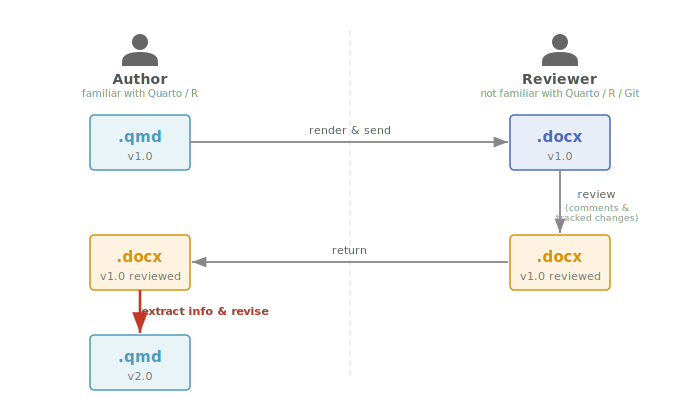
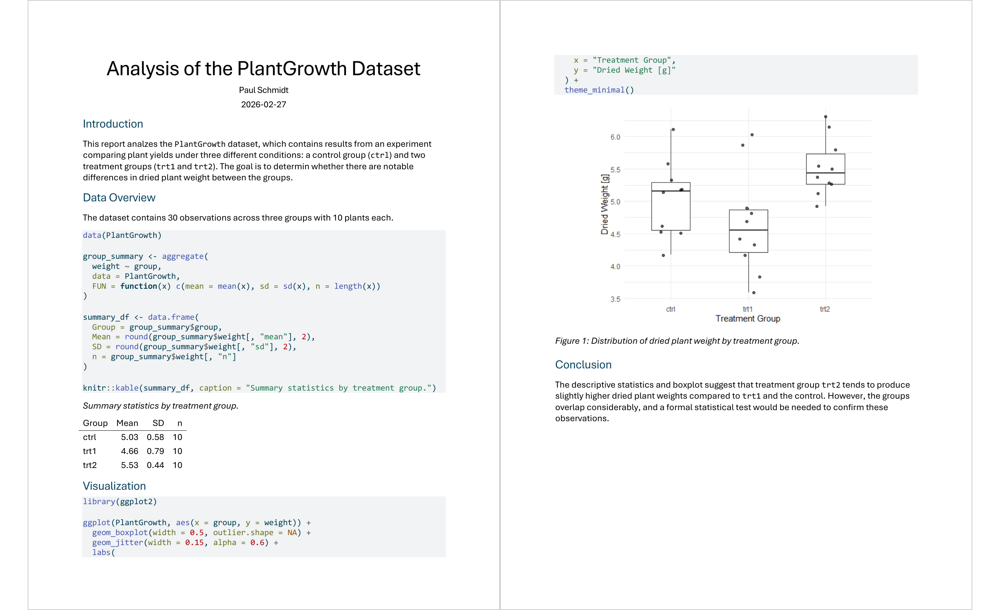
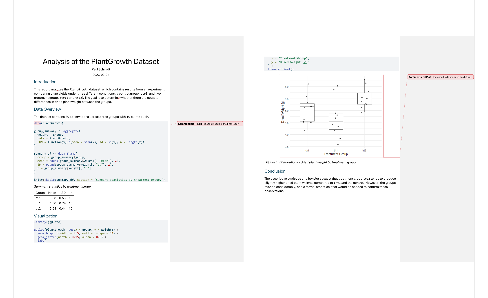
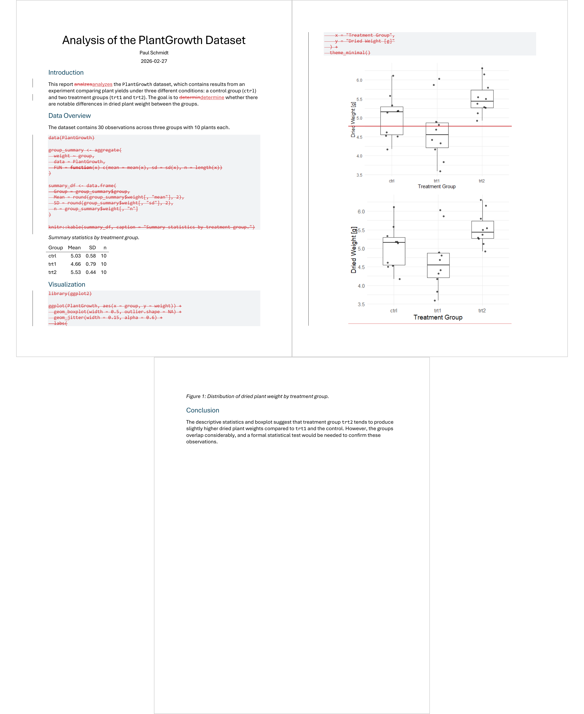

## Motivation

When writing reports in Quarto or R Markdown, one often needs feedback from
collaborators who are not familiar with Quarto, R, Python, Git etc. One common
denominator is Microsoft Word: one renders the source document to `.docx`, sends
it to a reviewer, and receives it back with comments and tracked changes. Then
one has to extract that feedback and incorporate it back into the original source
file.



### The Bottleneck

The highlighted arrow in the diagram above marks the critical step: extracting
reviewer feedback from the `.docx` file, interpreting it, and translating it
into edits in the source document. This step is manual, error-prone, and
time-consuming --- especially when dealing with multiple reviewers or lengthy
documents.

### The Idea

An LLM can assist with summarizing, prioritizing, and even applying reviewer
feedback. However, passing the entire `.docx` to an LLM is not ideal: it
contains too many tokens, too much noise, and exposes reviewer names to the
model.

**{docxreview}** provides R functions that extract only the relevant
parts --- comments and tracked changes with their surrounding context --- as
structured Markdown. This has two advantages:

1. **Focused extraction** --- only the information that matters, saving tokens
   and reducing noise.
2. **Anonymization** --- reviewer names can optionally be replaced with neutral
   aliases (e.g. "Reviewer 1"), keeping personal data out of the LLM.

Once the structured feedback is available, one can process it manually or hand
it to any LLM to summarize, create a TODO list, prioritize, or draft a revised
source document.

## An Example

To demonstrate the full workflow, we use a short Quarto report that analyzes
R's built-in `PlantGrowth` dataset. The source files are available in the
[vignettes/ directory](https://github.com/SchmidtPaul/docxreview/tree/master/vignettes)
of the GitHub repository:

| File | Description |
|------|-------------|
| `example-report.qmd` | Original Quarto source |
| `example-report.docx` | Rendered Word document |
| `example-report-reviewed.docx` | Word document after review |

## The Source Document

The original report (`example-report.qmd`) contains a few intentional
imperfections that a reviewer would flag:

- **Typos** in the introduction: "analzes" instead of "analyzes" and "determin"
  instead of "determine"
- **Visible R code** in the rendered document (no `echo: false`)
- **Small font size** in the plot (ggplot2 default theme)

<details>
<summary style="cursor:pointer;padding:6px 0;"><svg xmlns="http://www.w3.org/2000/svg" width="56" height="36" style="vertical-align:middle;margin-right:6px;"><rect x="1" y="1" width="54" height="34" rx="3" fill="#e8f4f8" stroke="#4a9aba" stroke-width="1.5"/><text x="28" y="16" font-family="Segoe UI,Arial,sans-serif" font-size="12" font-weight="600" fill="#4a9aba" text-anchor="middle">.qmd</text><text x="28" y="30" font-family="Segoe UI,Arial,sans-serif" font-size="9" fill="#777" text-anchor="middle">v1.0</text></svg> <code>example-report.qmd</code> <span style="color:#999;font-size:0.85em;">(click to expand)</span></summary>

````
---
title: "Analysis of the PlantGrowth Dataset"
author: "Paul Schmidt"
date: today
format: docx
---

## Introduction

This report analzes the `PlantGrowth` dataset, which contains results from an
experiment comparing plant yields under three different conditions: a control
group (`ctrl`) and two treatment groups (`trt1` and `trt2`). The goal is to
determin whether there are notable differences in dried plant weight between
the groups.

## Data Overview

The dataset contains 30 observations across three groups with 10 plants each.

```{r}
data(PlantGrowth)

group_summary <- aggregate(
  weight ~ group,
  data = PlantGrowth,
  FUN = function(x) c(mean = mean(x), sd = sd(x), n = length(x))
)

summary_df <- data.frame(
  Group = group_summary$group,
  Mean = round(group_summary$weight[, "mean"], 2),
  SD = round(group_summary$weight[, "sd"], 2),
  n = group_summary$weight[, "n"]
)

knitr::kable(summary_df, caption = "Summary statistics by treatment group.")
```

## Visualization

```{r}
#| label: fig-boxplot
#| fig-cap: "Distribution of dried plant weight by treatment group."

library(ggplot2)

ggplot(PlantGrowth, aes(x = group, y = weight)) +
  geom_boxplot(width = 0.5, outlier.shape = NA) +
  geom_jitter(width = 0.15, alpha = 0.6) +
  labs(
    x = "Treatment Group",
    y = "Dried Weight [g]"
  ) +
  theme_minimal()
```

## Conclusion

The descriptive statistics and boxplot suggest that treatment group `trt2`
tends to produce slightly higher dried plant weights compared to `trt1` and
the control. However, the groups overlap considerably, and a formal statistical
test would be needed to confirm these observations.
````

</details>

<p><svg xmlns="http://www.w3.org/2000/svg" width="56" height="36" style="vertical-align:middle;margin-right:6px;"><rect x="1" y="1" width="54" height="34" rx="3" fill="#e8eef8" stroke="#4a6aba" stroke-width="1.5"/><text x="28" y="16" font-family="Segoe UI,Arial,sans-serif" font-size="12" font-weight="600" fill="#4a6aba" text-anchor="middle">.docx</text><text x="28" y="30" font-family="Segoe UI,Arial,sans-serif" font-size="9" fill="#777" text-anchor="middle">v1.0</text></svg> After rendering, the <code>.docx</code> file is sent to a reviewer.</p>



## The Review

The reviewer opens the document in Microsoft Word with Track Changes enabled and:

1. **Corrects the typos** — Word tracks these as insertions of the missing
   characters
2. **Adds a comment** on a code block: *"Hide the R code in the final report"*
3. **Adds a comment** on the figure: *"Increase the font size in this figure"*

<p><svg xmlns="http://www.w3.org/2000/svg" width="80" height="36" style="vertical-align:middle;margin-right:6px;"><rect x="1" y="1" width="78" height="34" rx="3" fill="#fef3e0" stroke="#d4920a" stroke-width="1.5"/><text x="40" y="16" font-family="Segoe UI,Arial,sans-serif" font-size="12" font-weight="600" fill="#d4920a" text-anchor="middle">.docx</text><text x="40" y="30" font-family="Segoe UI,Arial,sans-serif" font-size="9" fill="#777" text-anchor="middle">v1.0 reviewed</text></svg> The result is <code>example-report-reviewed.docx</code></p>



## Extracting Feedback

With {docxreview}, extracting all feedback takes a single function call:

```r
library(docxreview)

extract_review("example-report-reviewed.docx")
```

This prints a structured Markdown summary to the console:

<details open>
<summary><code>extract_review()</code> output</summary>

```
# Review Feedback: example-report-reviewed.docx

## Comments (2)

### 1. Paul Schmidt - BioMath GmbH (2026-02-27) — p. 1, § Data Overview
> **Commented text:** "data"
> **Paragraph:** "data(PlantGrowth)group_summary <- aggregate( ..."

**Comment:** Hide the R code in the final report

---

### 2. Paul Schmidt - BioMath GmbH (2026-02-27) — p. 2, § Visualization
> **Commented text:** ""
> **Paragraph:** ""

**Comment:** Increase the font size in this figure

---

## Tracked Changes (2)

### 1. [Insertion] Paul Schmidt - BioMath GmbH (2026-02-27) — p. 1, § Introduction
> **Inserted:** "y"
> **Paragraph:** "This report anal**y**zes the PlantGrowth dataset, ..."

---

### 2. [Insertion] Paul Schmidt - BioMath GmbH (2026-02-27) — p. 1, § Introduction
> **Inserted:** "e"
> **Paragraph:** "This r**e**port analyzes the PlantGrowth dataset, ..."

---
```

</details>

## Output Options

Save to a file instead of printing to the console:

```r
extract_review("example-report-reviewed.docx", output_file = "feedback.md")
```

**Anonymize reviewer names** with `anonymize = TRUE`. This replaces all author
names with neutral aliases ("Reviewer 1", "Reviewer 2", ...) in the Markdown
output --- including any `@mentions` within comment text. A sidecar
`feedback-reviewers.md` mapping file is written alongside the output file:

```r
extract_review("example-report-reviewed.docx", output_file = "feedback.md",
               anonymize = TRUE)
```

**Group feedback by reviewer** with `group_by_author = TRUE`:

```r
extract_review("example-report-reviewed.docx", group_by_author = TRUE)
```

## Programmatic Access

For filtering or further processing, use the individual extraction functions
that return tibbles:

```r
comments <- extract_comments("example-report-reviewed.docx")
comments
```

```
# A tibble: 2 x 9
  comment_id author                      date                 comment_text
  <chr>      <chr>                       <chr>                <chr>
1 4          Paul Schmidt - BioMath GmbH 2026-02-27T21:15:00Z Hide the R code i…
2 7          Paul Schmidt - BioMath GmbH 2026-02-27T21:15:00Z Increase the font…
# i 5 more variables: commented_text <chr>, paragraph_context <chr>,
#   parent_comment_id <chr>, page <int>, section <chr>
```

```r
changes <- extract_tracked_changes("example-report-reviewed.docx")
changes
```

```
# A tibble: 2 x 8
  change_id type      author                      date
      <int> <chr>     <chr>                       <chr>
1         1 insertion Paul Schmidt - BioMath GmbH 2026-02-27T21:14:00Z
2         2 insertion Paul Schmidt - BioMath GmbH 2026-02-27T21:14:00Z
# i 4 more variables: changed_text <chr>, paragraph_context <chr>,
#   page <int>, section <chr>
```

## Sending Version 2 Back to the Reviewer

After incorporating the feedback into a revised `example-report-v2.qmd` and
re-rendering to `.docx`, the reviewer receives a clean document without any
visible changes. They would have to compare side-by-side manually or trust that
all feedback was addressed.

<details>
<summary style="cursor:pointer;padding:6px 0;"><svg xmlns="http://www.w3.org/2000/svg" width="56" height="36" style="vertical-align:middle;margin-right:6px;"><rect x="1" y="1" width="54" height="34" rx="3" fill="#e8f4f8" stroke="#4a9aba" stroke-width="1.5"/><text x="28" y="16" font-family="Segoe UI,Arial,sans-serif" font-size="12" font-weight="600" fill="#4a9aba" text-anchor="middle">.qmd</text><text x="28" y="30" font-family="Segoe UI,Arial,sans-serif" font-size="9" fill="#777" text-anchor="middle">v2.0</text></svg> <code>example-report-v2.qmd</code> <span style="color:#999;font-size:0.85em;">(click to expand)</span></summary>

The revised source fixes the typos, hides R code with `echo: false`, and uses
a larger font size in the plot:

````
---
title: "Analysis of the PlantGrowth Dataset"
author: "Paul Schmidt"
date: today
format: docx
---

## Introduction

This report analyzes the `PlantGrowth` dataset, which contains results from an experiment comparing plant yields under three different conditions: a control group (`ctrl`) and two treatment groups (`trt1` and `trt2`). The goal is to determine whether there are notable differences in dried plant weight between the groups.

## Data Overview

The dataset contains 30 observations across three groups with 10 plants each.

```{r}
#| echo: false
data(PlantGrowth)

group_summary <- aggregate(
  weight ~ group,
  data = PlantGrowth,
  FUN = function(x) c(mean = mean(x), sd = sd(x), n = length(x))
)

summary_df <- data.frame(
  Group = group_summary$group,
  Mean = round(group_summary$weight[, "mean"], 2),
  SD = round(group_summary$weight[, "sd"], 2),
  n = group_summary$weight[, "n"]
)

knitr::kable(summary_df, caption = "Summary statistics by treatment group.")
```

## Visualization

```{r}
#| label: fig-boxplot-v2
#| fig-cap: "Distribution of dried plant weight by treatment group."
#| echo: false

library(ggplot2)

ggplot(PlantGrowth, aes(x = group, y = weight)) +
  geom_boxplot(width = 0.5, outlier.shape = NA) +
  geom_jitter(width = 0.15, alpha = 0.6) +
  labs(
    x = "Treatment Group",
    y = "Dried Weight [g]"
  ) +
  theme_minimal() +
  theme(text = element_text(size = 14))
```

## Conclusion

The descriptive statistics and boxplot suggest that treatment group `trt2` tends to produce slightly higher dried plant weights compared to `trt1` and the control. However, the groups overlap considerably, and a formal statistical test would be needed to confirm these observations.
````

</details>

<p><svg xmlns="http://www.w3.org/2000/svg" width="56" height="36" style="vertical-align:middle;margin-right:6px;"><rect x="1" y="1" width="54" height="34" rx="3" fill="#e8eef8" stroke="#4a6aba" stroke-width="1.5"/><text x="28" y="16" font-family="Segoe UI,Arial,sans-serif" font-size="12" font-weight="600" fill="#4a6aba" text-anchor="middle">.docx</text><text x="28" y="30" font-family="Segoe UI,Arial,sans-serif" font-size="9" fill="#777" text-anchor="middle">v2.0</text></svg> After re-rendering, the reviewer receives a clean <code>example-report-v2.docx</code> without any tracked changes.</p>

### Generating a Comparison Document

`compare_versions()` solves this by producing a `.docx` where Word marks all
differences as tracked changes --- so the reviewer sees exactly what was
modified:

```r
compare_versions("example-report.docx", "example-report-v2.docx",
                 output_file = "example-report-diff.docx")
```

> **Note:** `compare_versions()` requires Microsoft Word, Python, and the
> `pywin32` package (Windows only). See `?compare_versions` for setup details.

<p><svg xmlns="http://www.w3.org/2000/svg" width="66" height="36" style="vertical-align:middle;margin-right:6px;"><rect x="1" y="1" width="64" height="34" rx="3" fill="#fef3e0" stroke="#d4920a" stroke-width="1.5"/><text x="33" y="16" font-family="Segoe UI,Arial,sans-serif" font-size="12" font-weight="600" fill="#d4920a" text-anchor="middle">.docx</text><text x="33" y="30" font-family="Segoe UI,Arial,sans-serif" font-size="9" fill="#777" text-anchor="middle">diff</text></svg> The resulting <code>example-report-diff.docx</code> highlights every change between v1 and v2:</p>



| File | Description |
|------|-------------|
| `example-report-v2.qmd` | Revised Quarto source |
| `example-report-v2.docx` | Rendered revised document |
| `example-report-diff.docx` | Comparison: v1 vs v2 with tracked changes |

## Incorporating Feedback with an LLM

The structured Markdown output from `extract_review()` can be passed to any LLM
(ChatGPT, Claude, Gemini, etc.) to automate source revisions. Save the feedback
to a file and include it in your prompt:

```r
extract_review("example-report-reviewed.docx", output_file = "feedback.md")
```

Then ask the LLM:

> "Here is the review feedback from `feedback.md`. Please revise
> `example-report.qmd` to address all comments and tracked changes."

The LLM will typically:

1. Read the extracted comments and tracked changes.
2. Understand your source document's structure.
3. Apply the necessary edits --- for our example:
   - Add `echo: false` to each code chunk (hiding R code).
   - Add `theme(text = element_text(size = 14))` to the ggplot (larger font).
   - Fix "analzes" → "analyzes" and "determin" → "determine" (typo
     corrections).
4. Report a summary of all changes made.

The revised QMD can then be re-rendered to produce a clean DOCX that addresses
all reviewer feedback.

### Claude Code + btw

[Claude Code](https://docs.anthropic.com/en/docs/claude-code) with the
[btw](https://github.com/posit-dev/btw) MCP server can run the entire workflow
in a single step --- extracting feedback, reading the source, and applying edits.
{docxreview} ships with a Claude Code skill file. Register it via:

```r
system.file("skills", "docxreview", package = "docxreview")
```

Then open Claude Code and enter a prompt like:

> "Extract the review feedback from `example-report-reviewed.docx` and revise
> `example-report.qmd` to address all comments and tracked changes."

## Try It Yourself

All example files are available in the
[vignettes/ directory](https://github.com/SchmidtPaul/docxreview/tree/master/vignettes)
of the GitHub repository:

| File | Description |
|------|-------------|
| `example-report.qmd` | Original Quarto source |
| `example-report.docx` | Rendered Word document |
| `example-report-reviewed.docx` | Word document after review |
| `example-report-v2.qmd` | Revised Quarto source |
| `example-report-v2.docx` | Rendered revised document |
| `example-report-diff.docx` | Comparison: v1 vs v2 with tracked changes |

Download the files and try the workflow --- or start with the basic extraction:

```r
library(docxreview)
extract_review("example-report-reviewed.docx")
```
